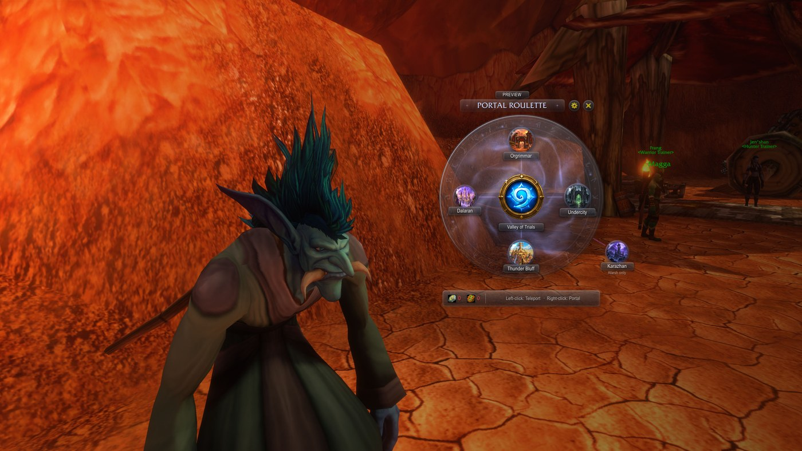
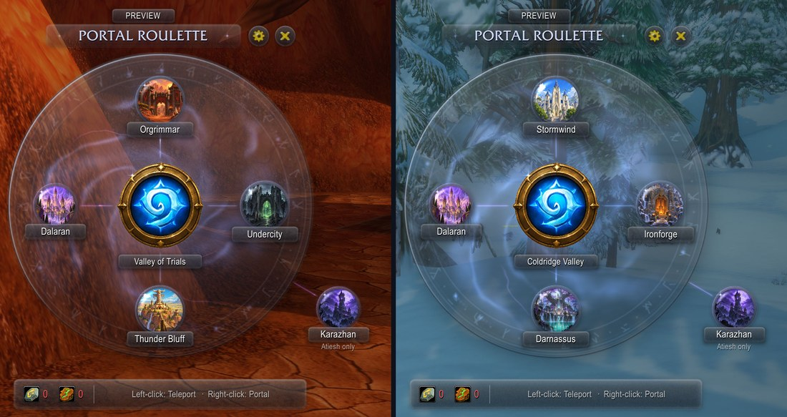
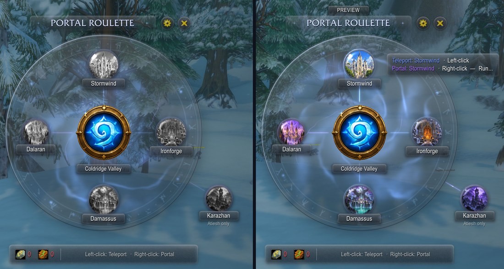
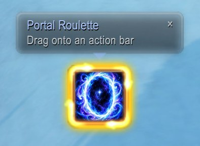

# Portal Roulette

**Portal Roulette** puts every mage teleport and portal on one frosted-glass wheel, for **World of
Warcraft: Forever**.

Open the wheel, then left-click a destination to teleport or right-click it to open a portal. Your
hearthstone sits in the middle.

## Features

- **One wheel per faction.**
  - Alliance: Stormwind, Ironforge, Darnassus.
  - Horde: Orgrimmar, Undercity, Thunder Bluff.
  - Every faction: Dalaran (Forever's new Teleport: Dalaran) inside the wheel, and Karazhan as a
    satellite linked to the wheel for Atiesh owners.
- **Left-click teleports, right-click opens a portal**, from secure, combat-safe buttons.
  Destinations you haven't learned yet stay on the wheel, dimmed, and their tooltip shows the level
  you learn them at.
- **Your hearthstone in the centre**, with its cooldown and your bind location. A Crumbling
  Hearthstone is used only when you have no Hearthstone.
- **Reagent counts** for Rune of Teleportation and Rune of Portals (reagent bag included), with a
  warning on a destination you can't afford. They hide themselves once you have the Reagent Economy
  perk.
- **Arcane glass look.** Slowly circulating energy, small lights orbiting the rim, glowing links with
  pulses of light running out to each destination, and an occasional shimmer across the glass.
- **Cinematic presentation** (on by default). The game UI steps aside and your character turns to face
  the camera. Everything is restored when you close the wheel, enter combat or log out, and even after
  a crash.
- **Never in your way.**
  - A ready check, group or guild invite, dungeon proposal or loot roll brings the game UI back, with
    the wheel still open. The UI hides again once you've answered.
  - Pressing Enter to chat brings the game UI back too.
  - Combat closes the wheel instantly.
- **Group friendly.** It can announce your portals, and asks before you teleport away from your
  group.
- **Launcher button** you can drag onto an action bar. It glows until you place it, and hides itself
  once it's on a bar. Also: a minimap button, an Addon Compartment entry and a key binding.

## Screenshots

**One wheel per faction**, Horde and Alliance:

**Before and after learning**: unlearned destinations are greyed out. Hovering a destination shows
both spells and what they need:

**The launcher** glows until you drag it onto an action bar:

## Launcher

| Action | What it does |
|---|---|
| Click | Open or close the wheel |
| Drag | Place the Portal Roulette macro on an action bar |
| Shift-drag | Move the launcher (unless locked in the options) |
| Shift-right-click | Open the options |

## Options

Options → AddOns → Portal Roulette:

- **Wheel:** reagent counts (auto, always, hidden), Karazhan without Atiesh, grouped-teleport
  confirmation, wheel scale.
- **Animation:** all animations, idle motion, hover effects.
- **Sound:** sounds, hover sounds, sound set (Portal Roulette or game UI sounds), volume channel.
- **Presentation:** hide the game UI, cinematic camera, camera orbit, cast framing.
- **Launcher:** lock, minimap button, glow (blue pulse, spell alert or off), scale.
- **Group broadcast:** announce portals or teleports.

## Commands

| Command | What it does |
|---|---|
| `/pr` | Open or close the wheel |
| `/pr options` | Open the options |
| `/pr preview` | Show every destination without casting (handy on a low-level mage) |
| `/pr reset` | Reset the wheel and launcher positions |
| `/pr debug` | Print the wheel's state (for bug reports) |
| `/pr debug trace on\|off` | Record why the wheel closes, to SavedVariables (for bug reports) |

## Requirements

- WoW: Forever (Interface 16001). The TBC Anniversary version is frozen at tag `v0.1.1-tbc`.
- Mage characters only. Other classes get no UI at all.

Embedded libraries (installed automatically with the release): LibGlass-1.0, LibShowcase-1.0,
LibStub, CallbackHandler-1.0, LibDataBroker-1.1, LibDBIcon-1.0.

## Development

- Tests: `pwsh tests/run.ps1` (Lua 5.1). It also checks that the sibling LibGlass and LibShowcase
  checkouts match the tags pinned in `.pkgmeta`.
- Deploy to the game: `pwsh Tools/deploy.ps1` (`-Probe` also installs the measurement probe). LibGlass
  and LibShowcase come from sibling checkouts (`..\LibGlass`, `..\LibShowcase`).
- Generated art: `python Tools/make_art.py` (effects), `Tools/make_city_art.py` and
  `Tools/make_launcher_art.py`.
- What has been measured in game is in `docs/FOREVER-PROBE.md`. Agent instructions are in
  `AGENTS.md`.
